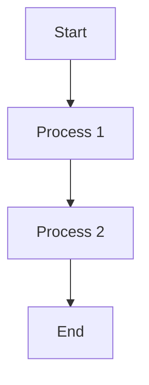

# ristretto

readme file 
- [ ] install
- [ ] usage
- [ ] examples
- [ ] api   
- [ ] docs
- [ ] contribute
- [ ] license

```mermaid
flowchart TD;
    A[Start] --> B[Process 1];
    B --> C[Process 2];
    C --> D[End];
```