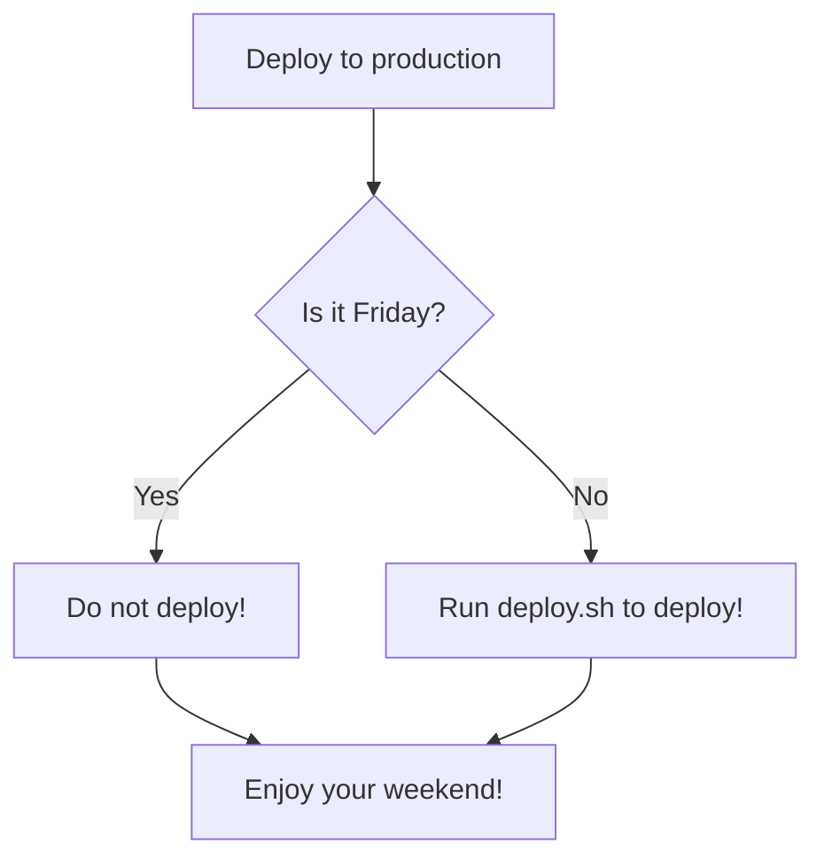

# Mermaid Of Examples

Here's some mermaid:


```mermaid
flowchart TD
    A[Deploy to production] --> B{Is it Friday?};
    B --> |Yes| C[Do not deploy!];
    B --> |No| D[Run deploy.sh to deploy!]
    C --> E[Enjoy your weekend!];
    D --> E[Enjoy your weekend!];
```

Here's some javascript:

```js
// Hello world in JavaScript

console.log("Hello World");
```
